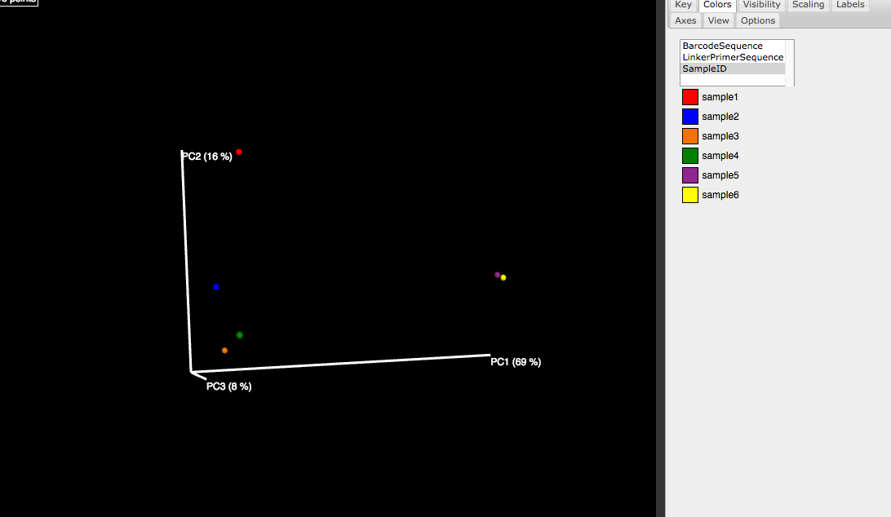
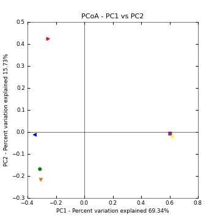
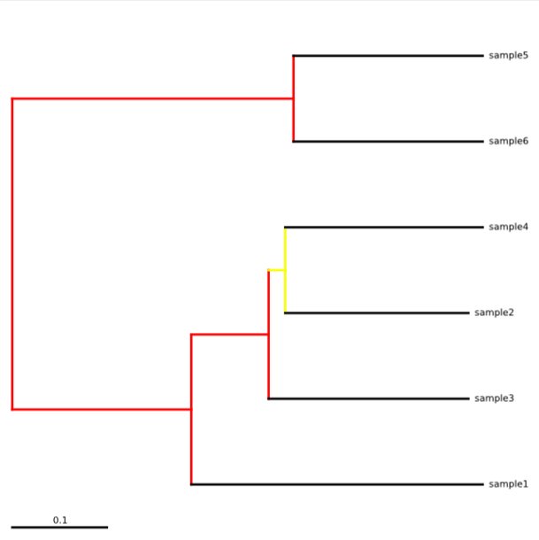
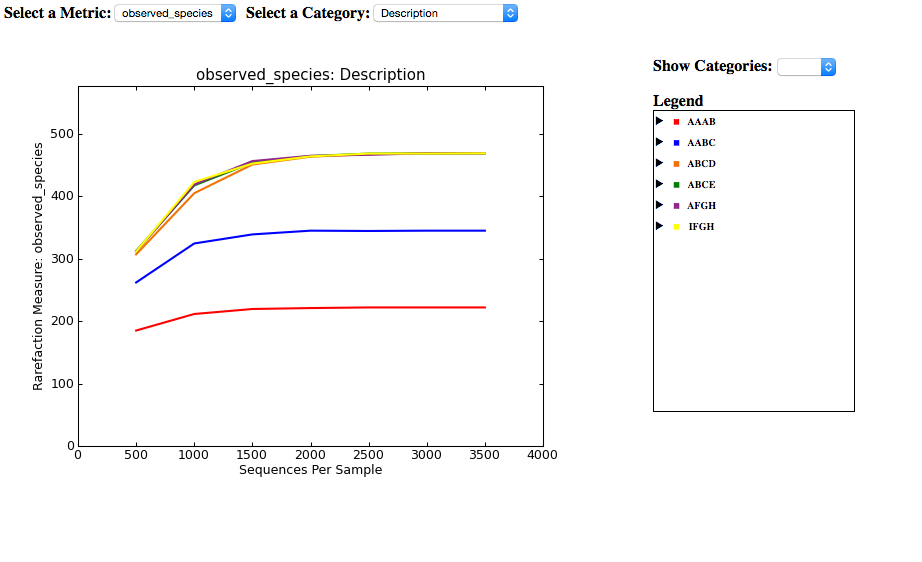
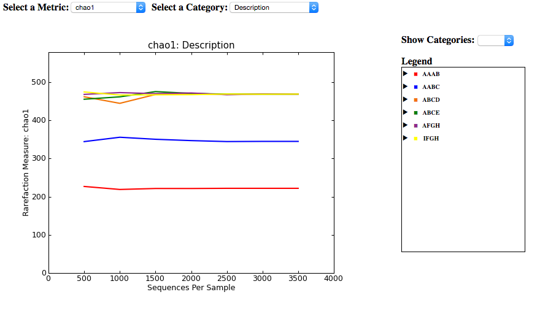

Recipe 008: Do diversity analysis using IGS
##################################################

This recipe shows the procedure to do diversity analysis using the concept of
IGS, for whole shotgun metagenomic sequencing data. 

Basically instead of using OTUs, IGSs(informative genomic segment) are used as
the cornerstone to evaluate diversity. The recipe mainly shows the pipeline
to generate the IGSs-by-samples matrix from raw sequencing reads. After 
we get the IGSs-
by-samples matrix, we use QIIME to do the alpha/beta diversity analysis.

For this recipe, firstly we create 6 synthetic samples (Sample 1-6)
based on 9 synthetic 10K 
genomes (genome A-I), with different composition of species and diversity.

The sequencing depth of all the synthetic data sets is 10X. For simplicity,
there is no sequencing errors introduced in the synthetic reads data sets.

The final species abundance for each synthetic sample is as below::

    sample1: genomeA -> 30, genomeB -> 10

    sample2: genomeA -> 20, genomeB -> 10, genomeC -> 10

    sample3: genomeA -> 10, genomeB -> 10, genomeC -> 10, genomeD -> 10

    sample4: genomeA -> 10, genomeB -> 10, genomeC -> 10, genomeE -> 10

    sample5: genomeA -> 10, genomeF -> 10, genomeG -> 10, genomeH -> 10

    sample6: genomeI -> 10, genomeF -> 10, genomeG -> 10, genomeH -> 10

The synthetic sequencing data sets for the 6 samples are sample_1.fa, sample_2
.fa, sample_3.fa, etc.

.. shell start

.. ::

   . ~/dev/ipy7/bin/activate
   set -e
   
   # create 9 simulated genomes.
   python ~/dev/nullgraph/make-random-genome.py -l 10000 -s 1  > genomeA.fa
   python ~/dev/nullgraph/make-random-genome.py -l 10000 -s 2  > genomeB.fa
   python ~/dev/nullgraph/make-random-genome.py -l 10000 -s 3  > genomeC.fa
   python ~/dev/nullgraph/make-random-genome.py -l 10000 -s 4  > genomeD.fa
   python ~/dev/nullgraph/make-random-genome.py -l 10000 -s 5  > genomeE.fa
   python ~/dev/nullgraph/make-random-genome.py -l 10000 -s 6  > genomeF.fa
   python ~/dev/nullgraph/make-random-genome.py -l 10000 -s 7  > genomeG.fa
   python ~/dev/nullgraph/make-random-genome.py -l 10000 -s 8  > genomeH.fa
   python ~/dev/nullgraph/make-random-genome.py -l 10000 -s 9  > genomeI.fa
 
 
   # build a read set
   python ~/dev/nullgraph/make-reads.py -C 30 -e 0.00 genomeA.fa > reads_A_30.fa
   python ~/dev/nullgraph/make-reads.py -C 20 -e 0.00 genomeA.fa > reads_A_20.fa
   python ~/dev/nullgraph/make-reads.py -C 10 -e 0.00 genomeA.fa > reads_A_10.fa
   python ~/dev/nullgraph/make-reads.py -C 10 -e 0.00 genomeB.fa > reads_B_10.fa
   python ~/dev/nullgraph/make-reads.py -C 10 -e 0.00 genomeC.fa > reads_C_10.fa
   python ~/dev/nullgraph/make-reads.py -C 10 -e 0.00 genomeD.fa > reads_D_10.fa
   python ~/dev/nullgraph/make-reads.py -C 10 -e 0.00 genomeE.fa > reads_E_10.fa
   python ~/dev/nullgraph/make-reads.py -C 10 -e 0.00 genomeF.fa > reads_F_10.fa
   python ~/dev/nullgraph/make-reads.py -C 10 -e 0.00 genomeG.fa > reads_G_10.fa
   python ~/dev/nullgraph/make-reads.py -C 10 -e 0.00 genomeH.fa > reads_H_10.fa
   python ~/dev/nullgraph/make-reads.py -C 10 -e 0.00 genomeI.fa > reads_I_10.fa
   
   # build the synthetic data sets for samples
   cat reads_A_30.fa reads_B_10.fa >sample_1.fa
   cat reads_A_20.fa reads_B_10.fa reads_C_10.fa >sample_2.fa
   cat reads_A_10.fa reads_B_10.fa reads_C_10.fa reads_D_10.fa >sample_3.fa
   cat reads_A_10.fa reads_B_10.fa reads_C_10.fa reads_E_10.fa >sample_4.fa
   cat reads_A_10.fa reads_F_10.fa reads_G_10.fa reads_H_10.fa >sample_5.fa
   cat reads_I_10.fa reads_F_10.fa reads_G_10.fa reads_H_10.fa >sample_6.fa
   

The first thing we need do is to generate the hash table files for each
reads fasta file::

   for i in sample_*.fa; do load-into-counting.py -x 1e6 -k 20 $i.kh $i ;  done

Next we use a script ``get_comb_multi.py`` to generate the coverage of each read
across samples. For each sample reads fasta file, there is an output file 
containing the coverage information.

But before we run the script, we need to generate a ``config.txt`` file, which 
contains three lines, the first line with a list of hashtable files, the 
second line with a list of fasta files, and the third line with the size 
of memory available to use.

::

   ls sample_*.kh | awk '{ ORS=" "; print; }'>config.txt
   printf "\n" >>config.txt
   ls sample_*.fa | awk '{ ORS=" "; print; }' >>config.txt
   printf "\n" >>config.txt
   printf "30000000" >>config.txt
 
Let's run the script:

::

   ./python get_comb_multi.py config.txt

Let's check an output file::

    $ more sample_1.fa.comb
    read0f_genomeA.fa 24 18 10 10 10 0
    read1r_genomeA.fa 20 15 7 7 7 0
    read2r_genomeA.fa 19 12 7 7 7 0
    read3f_genomeA.fa 21 14 8 8 8 0
    read4r_genomeA.fa 19 14 6 6 6 0
    read5r_genomeA.fa 26 23 11 11 11 0
    read6r_genomeA.fa 19 15 8 8 8 0

Here we can see for each read in this sample (sample_1), the coverage numbers 
of this read across the 6 samples are listed in different columns. The order
of the samples is in accordance with the order of the files listed in the first
line of "config.txt" file.

Next we run ``count_spectrum_freq_multiple_files.py`` to get the count of reads
with each coverage spectrum across different samples.
A "coverage spectrum" is the coverage of a read 
across different samples. A read with a coverage spectrum as "1-0-0-0-2-1" 
has a coverage as "1" in sample1, is not covered in sample2,3,4, has a coverage
as "2" in sample5, has a coverage as "1" in sample 6 at last.

To run ``count_spectrum_freq_multiple_files.py``, a file with a list of the 
".comb" files should be generated beforehand:

::

   ls *.comb >comb.list
   python count_spectrum_freq_multiple_files.py comb.list all_sample.spectrum

An except from output file::

    0-0-0-0-10-10 0 0 0 0 372 372
    0-0-0-0-11-11 0 0 0 0 249 249
    0-0-0-0-12-12 0 0 0 0 252 252
    0-0-0-0-13-13 0 0 0 0 216 216
    0-0-0-0-14-14 0 0 0 0 66 66
    0-0-0-0-15-15 0 0 0 0 9 9
    0-0-0-0-16-16 0 0 0 0 36 36

Beta-diversity analysis
------------------------

This shows there are 372 reads in sample 5 and 372 reads in sample 5 with 
the coverage spectrum of "0-0-0-0-10-10". In other way, 372 reads in sample 5
and sample 6 respectfully have a coverage as 10 in both samples. Here because
there is no sequencing error in data sets, so the number of reads in both 
with same coverage spectrum is the same. (the ratio of 10:10)
If there is error, it may be different, but the ratio should be similar
to the ratio of the coverage in the spectrum. Divided 372
by 10, we can say 37 (we round 37.2 to 37) IGSs are shared by sample 5 and 
sample 6. Actually, the calculation should be (372+372)/(10+10). But in this
case, no big difference. All the IGSs have a coverage as 10 in both samples.

Next we can list all the IGSs and corresponding coverage(abundance) across
samples to get the IGSs-by-samples matrix.

Here we need a MAP file to store the meta data of the data set, 
which is also required by QIIME. Since this is synthetic data set, the MAP
file is pretty simple::

    $ more all_sample_MAP.txt
    #SampleID       BarcodeSequence LinkerPrimerSequence    Description
    sample1 A       A       AAAB
    sample2 A       A       AABC
    sample3 A       A       ABCD
    sample4 A       A       ABCE
    sample5 A       A       AFGH
    sample6 A       A       IFGH

::

   python seperate_IGS.py all_sample.spectrum all_sample_MAP.txt
   

An except from output file::
   
    202     0       0       0       0       13      13
    203     0       0       0       0       13      13
    204     0       0       0       0       13      13
    205     0       0       0       0       13      13
    206     0       0       0       0       13      13
    207     0       0       0       0       13      13
    208     0       0       0       0       13      13
    209     0       0       0       0       14      14
    210     0       0       0       0       14      14
    211     0       0       0       0       14      14
    212     0       0       0       0       14      14
    213     0       0       0       0       16      16
    214     0       0       0       0       16      16
    215     0       0       0       0       3       3
    216     0       0       0       0       3       3
    217     0       0       0       0       3       3
    218     0       0       0       0       3       3
    219     0       0       0       0       4       4

This output file lists all the IGSs and the corresponding abundance across
the 6 samples in each line.

Next we can use QIIME to do the beta analysis. Before that, we need to 
convert the IGSs-by-samples matrix into the BIOM format:

::

   biom convert -i  all_sample.spectrum.IGS -o all_sample.spectrum.IGS.biom --table-type="OTU table"

Also, we get some statistics from the BIOM file:

::

   biom summarize-table -i all_sample.spectrum.IGS.biom -o all_sample.spectrum.IGS.biom.summary.txt

Output summary file contains the number of counts in different sample. We
will need the information for the analysis below::

    Counts/sample detail:
     sample1: 1057.0
     sample2: 1956.0
     sample3: 2858.0
     sample4: 2858.0
     sample5: 2988.0
     sample6: 3886.0
 

With the BIOM file and MAP file, we can use QIIME pipeline to do beta diversity
analysis. See http://qiime.org/tutorials/tutorial.html for details.

Here we use beta diversity metrics as "bray curtis", which is set in preference
 file ``p_file.txt``.
 
 
Compute Beta Diversity and Generate Beta Diversity Plots
~~~~~~~~~~~~~~~~~~~~~~~~~~~~~~~~~~~~~~~~~~~~~~~~~~~~~~~~~

::

   beta_diversity_through_plots.py -i all_sample.spectrum.IGS.biom -o bdiv_even1000/ -m all_sample_MAP.txt -e 1000 -p p_file.txt

We can open the ``index.html`` file in folder ``bdiv_even1000/bray_curtis_emperor_pcoa_plot/``
to see the interactive PCA figure, like shown below.

   
   
We can also call a seperate script to draw 2D plots:

::

   make_2d_plots.py -i bdiv_even1000/bray_curtis_pc.txt -m all_sample_MAP.txt -o beta_2d_plots/

Jackknifed Beta Diversity and Hierarchical Clustering
~~~~~~~~~~~~~~~~~~~~~~~~~~~~~~~~~~~~~~~~~~~~~~~~~~~~~~

::

   jackknifed_beta_diversity.py -i all_sample.spectrum.IGS.biom -o bdiv_jk1000 -e 1000 -m  all_sample_MAP.txt -p p_file.txt
   make_bootstrapped_tree.py -m bdiv_jk1000/bray_curtis/upgma_cmp/master_tree.tre -s bdiv_jk1000/bray_curtis/upgma_cmp/jackknife_support.txt -o bdiv_jk1000/bray_curtis/upgma_cmp/jackknife_named_nodes.pdf

Alpha-diversity analysis
-------------------------

For alpha-diversity, the procedure is similar to beta-diversity shown above.
The difference is that for higher accuracy, we treat each sample seperately and
get the abundance distribution of IGSs in each sample.
 
To do this, instead of using script ``seperate_IGS.py``, we use script 
``seperate_IGS_for_alpha.py`` to list the IGSs out:

::

   python seperate_IGS_for_alpha.py all_sample.spectrum all_sample_MAP.txt

Next, the same as beta-diversity procedure::

   biom convert -i all_sample.spectrum.IGS.alpha -o all_sample.spectrum.IGS.alpha.biom --table-type="OTU table"
   biom summarize-table -i  all_sample.spectrum.IGS.alpha.biom -o all_sample.spectrum.IGS.alpha.biom.summary.txt

We'd like to calculate chao1 estimator, so we create a parameter file firstly:
::

   echo "alpha_diversity:metrics chao1,observed_species" > alpha_params.txt

Then run alpha diversity pipeline:
::

   alpha_rarefaction.py -i all_sample.spectrum.IGS.alpha.biom -m all_sample_MAP.txt -o wf_arare/ -p alpha_params.txt -f

Observed IGSs:

Chao1 estimator:

Resources and Links
~~~~~~~~~~~~~~~~~~~

`This recipe
<https://github.com/ged-lab/khmer-recipes/tree/master/004-estimate-sequencing-saturation>`__
is hosted in the khmer-recipes repository,
https://github.com/ged-lab/khmer-recipes/.

It requires the `khmer software <http://khmer.readthedocs.org>`__.

 
 